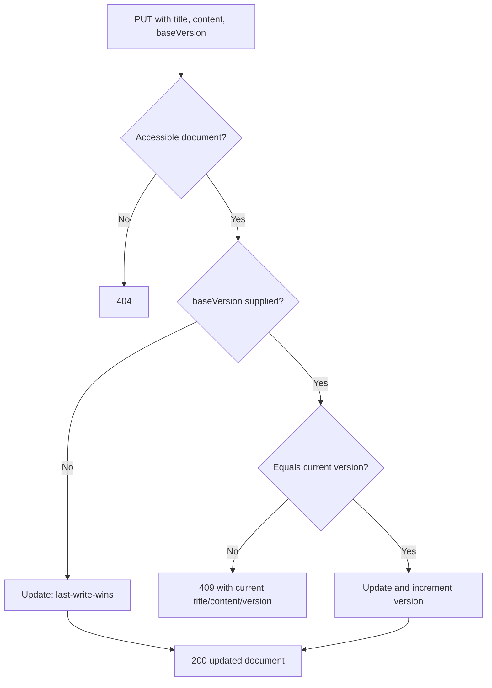

# HTTP API reference

Base URL: `${VITE_API_URL}/api` in the browser (typically `http://localhost:5000/api`). JSON request and response bodies are used throughout. All document and share routes require `Authorization: Bearer <JWT>`.

## Auth

| Method | Path | Body | Success |
|---|---|---|---|
| POST | `/auth/signup` | `{ "email", "password" }` | `201 { token, userId, email }` |
| POST | `/auth/login` | `{ "email", "password" }` | `200 { token, userId, email }` |

Signup returns `400 { error: "Email already in use" }` for an existing email. Login returns `401 { error: "Invalid email or password" }` for either missing account or bad password.

## Documents

| Method | Path | Body | Success |
|---|---|---|---|
| GET | `/documents` | — | `200 { owned: Document[], shared: Document[] }` |
| GET | `/documents/:id` | — | `200 Document` |
| POST | `/documents` | `{ title?, content? }` | `201 Document` |
| PUT | `/documents/:id` | `{ title, content, baseVersion? }` | `200 Document` |
| DELETE | `/documents/:id` | — | `200 { message: "Document deleted" }` |

`Document` is `{ id, title, content, version, createdAt, updatedAt, ownerId }`. `content` is normally a stringified TipTap JSON document; the API does not validate its format.

For PUT, `baseVersion` enables optimistic concurrency. If it is present and differs from the current document version, the API returns:

```json
{
  "error": "Conflict: document was modified elsewhere",
  "serverVersion": 8,
  "serverTitle": "Latest title",
  "serverContent": "{...}"
}
```

Omitting `baseVersion` bypasses this check. This is supported by the server but should be avoided by new clients because it permits a last-write-wins overwrite.

## Sharing

All share routes require that the caller own the document.

| Method | Path | Body | Success |
|---|---|---|---|
| POST | `/shares/:documentId` | `{ "email" }` | `201 { message, share }` |
| GET | `/shares/:documentId` | — | `200 DocumentShare[]` |
| DELETE | `/shares/:documentId/:userId` | — | `200 { message: "Access revoked" }` |

The POST uses an upsert, so sharing again with the same user succeeds without creating a duplicate. GET includes each recipient as `user: { id, email }`.

## Common error responses

| Status | Meaning in the current implementation |
|---|---|
| 400 | Duplicate signup email or self-share |
| 401 | Missing, malformed, invalid, or expired JWT; invalid login |
| 404 | Document is inaccessible/not found, or share target email does not exist |
| 409 | Conditional document update found a newer server version |
| 500 | Unhandled database, Redis, or runtime error (no centralized error formatter exists) |

Invalid route IDs, malformed bodies, and some Prisma failures are not consistently converted to client-friendly 4xx responses. Consumers should treat undocumented failures as possible 500s.

## REST authorization matrix

| Operation | Anonymous | Owner | Shared user | Why |
|---|---:|---:|---:|---|
| Sign up / log in | Allowed | — | — | Public entry points |
| List documents | Denied | Own list | Own + shared list | Filter uses `req.userId` |
| Read document | Denied | Allowed | Allowed | Owner-or-share query |
| Create document | Denied | Allowed | Allowed | New document belongs to caller |
| Update document | Denied | Allowed | Allowed | Any share is effectively editable |
| Delete document | Denied | Allowed | Denied | Prisma delete includes `ownerId` |
| Manage shares | Denied | Allowed | Denied | Owner-only lookup |

“Denied” generally manifests as 401 for missing/invalid tokens and 404 for a valid user with no matching accessible document. The 404 choice avoids confirming whether a document exists to an unauthorized REST caller.

## Versioned save decision tree



The client always sends `baseVersion` in its editor path. The optional server behavior is a compatibility escape hatch, not an endpoint contract a new client should depend on.

## Socket.IO protocol

Socket server URL: `VITE_SOCKET_URL`. There is no socket authentication today.

| Event | Direction | Payload | Effect |
|---|---|---|---|
| `join-document` | client → server | `documentId` | Joins the Socket.IO room named by the ID |
| `edit-document` | client → server | `{ documentId, title, content }` | Relays `document-updated` to all other room members |
| `document-updated` | server → client | `{ title, content }` | Updates the peer's in-memory editor |
| `document-saved` | client → server | `{ documentId, version }` | Relays `version-updated` to peers |
| `version-updated` | server → client | `{ version }` | Defined server-side; current client does not subscribe or emit `document-saved` |

No socket event persists or validates document content.
