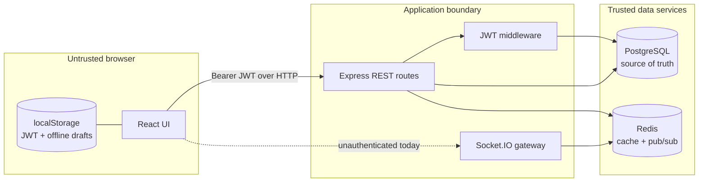
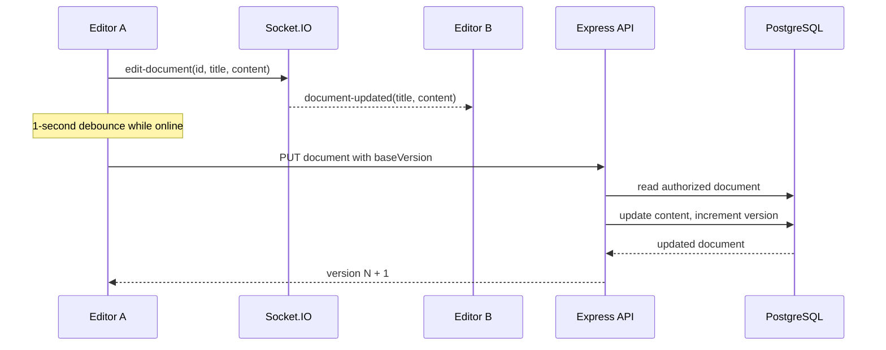

# Architecture

Docly is a two-process web application backed by PostgreSQL and Redis. The browser calls the Express API for durable data, and keeps a Socket.IO connection for low-latency editor updates.

```text
React + Vite browser
  | HTTP + Bearer JWT                 | Socket.IO
  v                                  v
Express API --------------------> Socket.IO server
  | Prisma + PostgreSQL adapter          | Redis pub/sub adapter
  v                                      v
PostgreSQL <------------------------- Redis
 durable source of truth                cache and cross-instance events
```

## Responsibilities

| Component | Responsibility | Important files |
|---|---|---|
| Client | Login UI, dashboard, TipTap editor, browser offline drafts | `client/src/` |
| HTTP API | Authentication, authorization for REST routes, CRUD, share management | `server/routes/` |
| Socket.IO | Document rooms and transient edit/version broadcasts | `server/index.ts` |
| PostgreSQL | Users, documents, versions, and share relations | `server/prisma/schema.prisma` |
| Redis | 60-second document/list cache and Socket.IO adapter pub/sub | `server/index.ts`, `server/routes/documents.ts` |

## Primary flows

### System boundary and trust zones



The dashed connection is intentional documentation of a gap, not an intended production architecture. REST requests are authenticated and authorized; socket traffic presently is not.

### Authentication

1. The client posts credentials to `/api/auth/signup` or `/api/auth/login`.
2. The server hashes passwords with bcrypt at signup and signs a seven-day JWT containing `userId`.
3. The client stores only the token in `localStorage`.
4. Axios attaches it as `Authorization: Bearer <token>`; REST middleware verifies it and sets `req.userId`.

### Editing and persistence

1. `Editor` loads `GET /api/documents/:id`, including the current `version`.
2. A local title or TipTap content update immediately broadcasts a Socket.IO `edit-document` event to the room.
3. While online, a one-second debounce sends `PUT /api/documents/:id` with `baseVersion`.
4. PostgreSQL is the source of truth. A successful update increments `version` and invalidates only the current requester's Redis keys.

Socket messages are deliberately transient: they update open peers, but do not save content themselves. HTTP persistence is required for a durable change.



This is **not** operational transformation (OT) or a CRDT. Two peers can temporarily display different content, and the next persisted write determines the durable version. The version check protects offline/stale HTTP saves, but it does not merge character-level edits.

### Offline and conflict flow

When `navigator.onLine` is false, the browser saves `{ title, content, baseVersion }` under `docly_offline_<id>` in localStorage. On the next `online` event it submits that draft. If the server version differs, the API replies 409 with both server fields. The UI asks the user to keep the local or server version; choosing local retries against the server version, so it overwrites the server copy.

## Authorization model

REST document reads and updates allow the owner or any user with a `DocumentShare`. Delete and share administration require ownership. A share's `permission` value is stored as `edit`, but it is not currently interpreted to implement role-specific behavior.

Important current boundary: Socket.IO connections and room joins have no JWT authentication or document-access check. REST authorization protects persistent data, but an untrusted client that can reach the socket endpoint can join a guessed document room and observe/send transient edits. See [Security notes](./SECURITY.md).

## Scaling characteristics

The Socket.IO Redis adapter makes a room broadcast reach connections on multiple API instances, provided every instance uses the same Redis service. HTTP caches are also shared through Redis. PostgreSQL remains the single durable writer. There is no load balancer, readiness check, request validation layer, or background job system in this repository.

For a multi-instance deployment, Redis pub/sub solves broadcast fan-out; it does not solve socket authentication, durable presence, collaborative merge semantics, or cache invalidation for every affected user. Those responsibilities remain application concerns.
