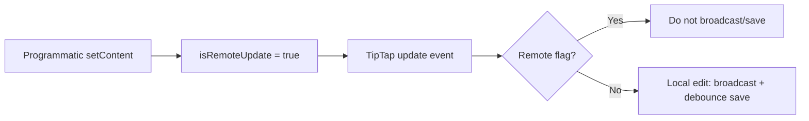

# Client guide

The client is a Vite React 19 single-page application. Its entry point is `src/main.jsx`; `App.jsx` owns the routes.

## Routes and components

| URL | Component | Behavior |
|---|---|---|
| `/` | redirect | Sends users to `/dashboard` |
| `/login` | `pages/Login.jsx` | Authenticates and stores JWT |
| `/signup` | `pages/Signup.jsx` | Creates account and stores JWT |
| `/dashboard` | `pages/Dashboard.jsx` | Lists, creates, and deletes owned documents; shows shared documents |
| `/editor/:id` | `pages/Editor.jsx` | Loads, edits, shares, syncs, and resolves conflicts |

`ProtectedRoute` only checks for a local token before rendering. It is a user-experience guard, not an authorization boundary; the API must remain authoritative.

## State and browser storage

| Key / state | Location | Purpose |
|---|---|---|
| `token` | localStorage | JWT read by Axios request interceptor |
| `docly_offline_<documentId>` | localStorage | Unsynced `{ title, content, baseVersion }` offline draft |
| `baseVersion` | Editor React state | Version sent with the next durable save |
| `isRemoteUpdate` | Editor ref | Prevents TipTap programmatic updates from generating a local save |
| debounce timer | Editor ref | Coalesces online changes for one second |

`useOnlineStatus` listens to browser `online` and `offline` events. It reports network-interface status, not proof that the API is reachable; an API error while the browser thinks it is online becomes “Sync failed.”

## Editor lifecycle

1. Fetch document over HTTP and prefer a locally stored offline draft if present.
2. Join Socket.IO room `id`; try to load share recipients (the request naturally fails for collaborators).
3. Set TipTap content with `isRemoteUpdate` temporarily enabled.
4. Local updates broadcast immediately and save after one second if online.
5. Incoming peer broadcasts replace the local in-memory title/content but do not update `baseVersion`.
6. A reconnect submits the offline draft and displays a conflict choice if the server has advanced.

TipTap's document JSON is serialized before it is stored or transmitted via HTTP. `extractPlainText` recursively reads this JSON only to make the conflict dialog human-readable.

### Why refs are used instead of state

`isRemoteUpdate`, `hasMounted`, and the debounce timer do not affect rendered UI, so React state would add unnecessary renders and can be awkward during event callbacks. Refs give each callback the current mutable value. This is especially important for the TipTap update loop:



The temporary 100 ms reset is a pragmatic guard around TipTap's callback timing, rather than a formal transaction boundary. A more robust evolution could use TipTap transaction metadata or explicit collaboration primitives.

### Known editor edge cases

- A remote socket update changes visible content but does not update `baseVersion`; a subsequent local save can receive 409 and retries in the normal online path.
- `navigator.onLine` can be true when the API is down; the editor labels this as a sync failure rather than an offline draft.
- Offline drafts are per-browser/per-document and are not encrypted, synchronized, or scoped by user ID. A different logged-in account on the same browser could encounter the same local key.
- The module-level socket is created when `Editor.jsx` is imported and is not disconnected on editor unmount. This is convenient for one SPA session but deserves lifecycle management in a larger app.

## Rich-text capabilities

`StarterKit` provides paragraphs, headings, lists, blockquotes, code blocks, history, and basic marks. Additional extensions enable underline, highlight, and heading/paragraph text alignment. The toolbar triggers TipTap commands directly.

## Environment variables

Create `client/.env` locally. Values are intentionally not committed.

```dotenv
VITE_API_URL=http://localhost:5000
VITE_SOCKET_URL=http://localhost:5000
```

Vite exposes only `VITE_`-prefixed variables to browser code. Never put a secret in this file; all values become part of the browser build.

## Extension checklist

- Add a page in `src/pages/`, then route it in `App.jsx`.
- Use the shared `api` instance; do not duplicate authorization headers.
- Preserve `isRemoteUpdate` around `editor.commands.setContent()` calls.
- If adding a persisted field, change the Prisma schema/migration, API shape, and client handling together.
- If changing TipTap content schema, plan a migration or backwards-compatible parser for existing `content` strings.
