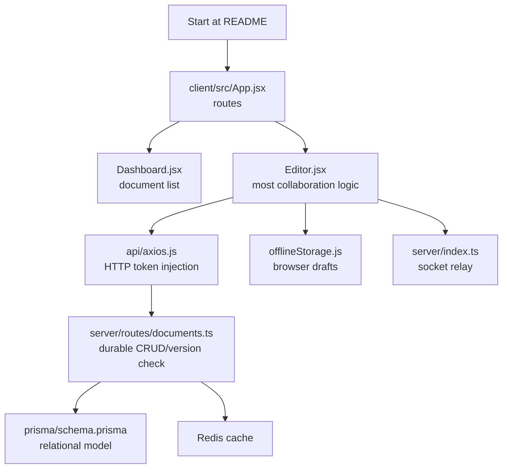

# Interview guide: explaining Docly

This guide is a map from an interview question to the exact code and a concise, technically honest answer. It describes what the repository does today, separates implemented behavior from intended production evolution, and avoids overstating the real-time model.

## 60-second project explanation

Docly is a PERN document editor with rich text, sharing, browser offline drafts, and transient Socket.IO collaboration. React and TipTap provide the editing experience; Express exposes the durable API; PostgreSQL stores users, documents, share relations, and a version number; Redis provides short-lived caching and lets Socket.IO rooms work across server instances. The most instructive feature is offline conflict handling: a reconnecting draft sends the version it began from, and the API returns a 409 plus the current server content when that version has changed. The user then chooses which whole-document version to retain.

The important caveat is that this is “live update + versioned persistence,” not Google Docs-grade concurrent editing. It has no OT/CRDT, socket authorization, or atomic conditional version update yet. Those are the first production hardening areas I would address.

## Codebase tour

If asked to read the project in order, begin with `README.md`, then `client/src/pages/Editor.jsx`, `server/routes/documents.ts`, `server/index.ts`, and `server/prisma/schema.prisma`. These five files reveal nearly all business behavior.

## Feature-to-code matrix

| Requirement | Client code | Server/data code | Explanation |
|---|---|---|---|
| Registration/login | `Login.jsx`, `Signup.jsx` | `routes/auth.ts`, `middleware/auth.ts` | bcrypt hashes at creation; JWT carries `userId` for 7 days |
| Protected pages | `ProtectedRoute.jsx`, `axios.js` | `authenticate` middleware | Frontend is UX only; server verifies token |
| Documents | `Dashboard.jsx`, `Editor.jsx` | `routes/documents.ts` | Owner creates/deletes; owner/share recipient reads/updates |
| Rich text | `Editor.jsx` | `Document.content` | TipTap JSON is serialized as a text column |
| Live peer updates | `Editor.jsx` | `index.ts` | Room broadcast excludes sender and does not persist |
| Offline drafts | `useOnlineStatus.js`, `offlineStorage.js` | conflict response in documents route | localStorage stores base version and payload |
| Sharing | Editor share modal | `routes/shares.ts`, `DocumentShare` | Owner invites a pre-existing user by email |
| Scaling/cache | none directly | Redis + Socket.IO adapter | Redis cache is 60 seconds; adapter forwards room traffic |

## Deep-dive questions and answers

### Why PostgreSQL rather than MongoDB?

The core domain is relational: documents have exactly one owner, can have many recipients, and a recipient can access many documents. PostgreSQL expresses this with foreign keys and a compound uniqueness constraint on `DocumentShare(documentId, userId)`. Prisma supplies type-oriented queries and migration files while retaining relational constraints. A document's rich text does not require a document database because it is stored as one content field; the access model is the stronger data-shape driver.

### Why Prisma rather than raw SQL?

Prisma centralizes the data model, migrations, and client access API. That improves development speed and makes relation queries readable, such as `shares: { some: { userId } }`. It does not eliminate database knowledge: migration SQL, transaction semantics, indexes, and query behavior still matter. The current version check exposes that trade-off—ORM convenience does not automatically make a two-query check atomic.

### Explain the authentication flow.

At signup, the server hashes the password with bcrypt cost factor 10 and writes only `passwordHash`. Login fetches by email and uses `bcrypt.compare`. On success both routes sign `{ userId }` using `JWT_SECRET` with a 7-day lifetime. The browser stores the token and Axios injects it into every API request. The `authenticate` middleware verifies signature/expiry and attaches `req.userId`. Each document/share route then performs a resource-level owner/share query. The JWT does not contain document permissions, which is good here because permission changes are read from the database rather than remaining stale inside a token.

### How does real-time collaboration work?

Opening an editor emits `join-document(id)`. The server puts the socket in a room named by that ID. A local edit emits `edit-document`; `socket.to(documentId)` sends `document-updated` to all room peers except the sender, preventing sender echo loops. Redis adapter pub/sub forwards those room broadcasts between API instances. HTTP autosave is independent: it runs after a one-second debounce and commits to PostgreSQL. In an interview, call this a lightweight collaboration signal path, not a full collaborative editing algorithm.

### Why is Socket.IO combined with Redis?

Without an adapter, a Socket.IO room exists only in the memory of one Node process. With multiple API replicas, a user on replica A would not reach a peer on replica B. The adapter publishes the event through Redis and every replica forwards it to local room members. Redis is also reused for cache-aside document responses, though these are distinct responsibilities and can be scaled/tuned separately in a mature system.

### How does offline conflict detection work?

Every durable document starts at version 1. The editor remembers the version from its initial load. While offline it stores title, serialized TipTap JSON, and that base version in localStorage. On reconnect it sends the draft and base version. The server compares it against the current version: equal means update and increment; different means 409 plus current server data. The UI renders both plain-text excerpts and lets the user keep either whole version. “Keep mine” retries using the server version, so it deliberately makes the local content the next authoritative version.

### What is the race condition in the current conflict implementation?

The server reads the document, compares version in application code, then runs an unconstrained update. Two simultaneous writers can both read version 7 and both pass comparison before either writes, leaving the later update to win. Incrementing version itself is atomic, but the read-check-write sequence is not. The remedy is a single conditional SQL update (`WHERE id AND version`) or Prisma `updateMany` condition, checking the affected count, preferably inside a transaction when subsequent work requires it.

### Why use localStorage, and what are its limits?

It is simple, available offline, and survives refresh/browser restart—appropriate for a learning project. It is not per-user, encrypted, synchronized, quota-proof, or protected from same-origin XSS. IndexedDB or a dedicated offline queue would be a stronger client persistence layer; encrypted server-side drafts may be required for sensitive documents.

### Explain the cache pattern and its weakness.

GET routes check Redis, query PostgreSQL only on a miss, then `SETEX` the JSON for 60 seconds. Cache keys include user ID so a response for one user is not served directly to another. Writes delete the acting user's document/list keys. The weakness is incomplete fan-out invalidation: a collaborator may retain stale cached content or list data until TTL expiry. A more robust design invalidates all access principals for a document, uses document versioned cache keys, publishes invalidation events, or chooses a cache strategy that tolerates those reads.

### How does sharing work?

The owner posts a recipient email. The server checks ownership, resolves the recipient user, rejects self-sharing, and upserts `DocumentShare`. The database compound unique constraint is the final protection against duplicates. Owner and share-recipient access queries use relations. The stored `permission` field currently defaults to `edit` but no read-only enforcement exists—this is a clear roadmap item rather than a finished ACL system.

### What happens on delete/revoke?

Only the owner can delete a document. `DocumentShare` relations cascade when a document or user is deleted. Revocation deletes a share row. However, cache invalidation does not currently delete the revoked collaborator's cache keys, and socket room membership is not evicted/authorized. A production implementation would publish invalidation/revocation and force the revoked user's active room session to leave.

## Design choices and trade-offs

| Choice | Benefit | Cost / follow-up |
|---|---|---|
| JWT bearer token | Stateless horizontal scaling | Revocation and localStorage/XSS concerns |
| TipTap JSON stored as text | Preserves rich document structure | No database-level content querying/validation |
| Socket room by document ID | Small, understandable relay model | Must authenticate and authorize every join |
| Debounced HTTP save | Fewer writes and simple UX | Last typed content can be lost before timer fires/navigation |
| Version conflict prompt | Explicit, understandable offline behavior | Whole-document overwrite, no merge |
| Redis cache-aside | Fast common reads | Staleness and invalidation complexity |
| Docker Compose | Repeatable local dependencies | No client container, health checks, or production orchestration |

## “What would you improve next?”

Prioritize by risk and user impact:

1. Authenticate/authorize Socket.IO handshakes and room joins; remove the initial permissive CORS middleware.
2. Add request validation, structured error middleware, rate limits, security headers, and secrets management.
3. Make optimistic updates atomic with a conditional version write; test concurrent requests.
4. Fix cache invalidation for all collaborators and sharing/revocation events.
5. Add a test harness: API authorization/conflict tests, browser offline/reconnect E2E tests, and socket integration tests.
6. Decide product-grade collaboration direction: CRDT/OT provider, durable operation log, cursor/presence, and merge UX.
7. Add deployment health checks, observability, backups, migrations policy, TLS, and a CI pipeline.

## Questions to avoid answering imprecisely

| Do not say | Say instead |
|---|---|
| “It is Google Docs-like collaboration.” | “It relays live updates and uses whole-document version conflicts; it is not CRDT/OT.” |
| “The version check fully prevents races.” | “It detects ordinary stale saves; an atomic compare-and-swap is the next hardening step.” |
| “Routes are protected by React.” | “React redirects for UX; Express JWT and resource checks protect REST data.” |
| “CORS/auth makes Socket.IO secure.” | “The current socket layer needs explicit JWT and document authorization.” |
| “Redis makes it scalable.” | “Redis enables cache and cross-instance event fan-out; complete production scaling needs more operational design.” |

## Practical demo script

1. Sign up two accounts using separate browsers/incognito windows.
2. Account A creates a document, applies a few TipTap formatting actions, and shares it with account B.
3. Open the shared document as B; type in A and show B receive the transient update.
4. Disconnect B's network, make a local edit, then modify/save in A.
5. Reconnect B and show the version conflict screen; explain the whole-document choice.
6. Revoke B from A and explain that REST access is denied after cache expiry, while noting the current cache/socket limitations honestly.

For questions not covered here, use the [architecture](./ARCHITECTURE.md), [API](./API.md), [database](./DATABASE.md), and [security](./SECURITY.md) references as the deeper source of record.
